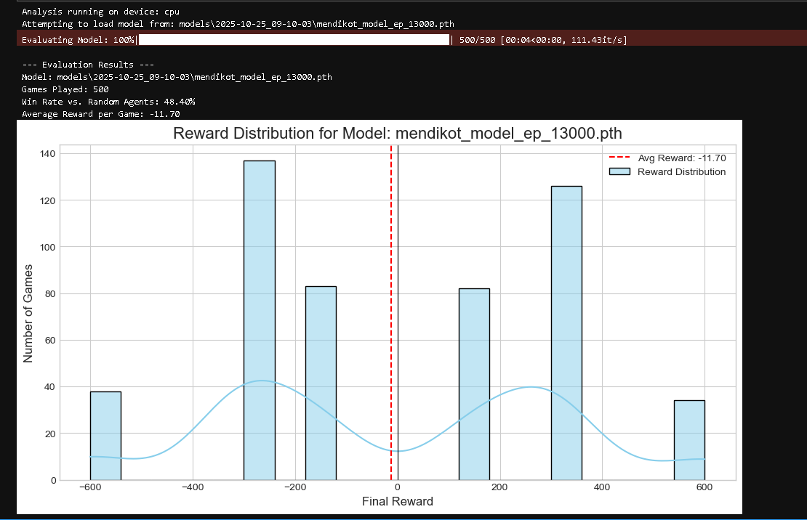

# MendikotZero: An AI for the Card Game Mendikot

[](https://opensource.org/licenses/MIT)


This repository contains the code for **MendikotZero**, an AI agent trained using modern Reinforcement Learning techniques to play the popular Indian card game *Mendikot* (also known as *Mindi*). 

The project chronicles the development from a simple rule-based agent to a sophisticated, planning-capable AI inspired by the **AlphaZero architecture**. Utilized Google Gemini 2.5 Pro as a technical accelerator for debugging MCTS logic and optimizing PyTorch implementation details. All architectural decisions and core logic were verified manually to ensure reproducibility.

---

## 📊 Key Learnings & Results

After thousands of simulated games, the MCTS-powered agent demonstrated a clear and positive learning trend. It evolved from a reckless "gambler" into a balanced and strategic player, capable of both strong offense and calculated defense.

The graph below shows the performance of the agent after **13,000 episodes** of training, proving it has learned to consistently achieve high-reward outcomes against random and heuristic baselines.


*(Note: Ensure 'graph.png' is present in your repository root)*

---

## 📑 Table of Contents
- [About the Game](#-about-the-game)
- [The AI's Architecture](#-the-ais-architecture-how-it-thinks)
- [Project Structure](#-project-structure)
- [Setup and Installation](#-setup-and-installation)
- [How to Use](#-how-to-use)

---

## 🃏 About the Game
**Mendikot** is a 4-player partnership trick-taking game popular in India. The primary objective is for a team to capture tricks that contain the **Tens (10s)** of each suit. 

This implementation uses:
*   A 48-card deck (2s removed).
*   Dynamic trump-declaration rules (the first player unable to follow suit sets the trump for the round).

---

## 🧠 The AI's Architecture: How it "Thinks"

MendikotZero is a learning system inspired by DeepMind's AlphaZero. Its decision-making process mimics a human grandmaster, broken down into three core components:

### 1. The Brain (Deep Neural Network)
The neural network provides the AI's "intuition." It doesn't calculate every possibility; it instantly senses the situation using two heads:
*   **Policy Head (Instinct):** Looks at the cards/table and answers: *"What are the 2-3 most logical cards to play right now?"*
*   **Value Head (Position):** Evaluates the game state and answers: *"Based on the cards played, who is currently winning?"*

### 2. The Thinking (Monte Carlo Tree Search - MCTS)
While the network provides intuition, MCTS provides deep, conscious planning.
1.  **Selection:** Starts from the current state and follows a promising path in its "imagination."
2.  **Expansion:** When it reaches a new position, it asks the Neural Network for intuitive moves.
3.  **Simulation:** Plays out the rest of the game in its head to see who wins.
4.  **Backpropagation:** The result (Win/Loss) reinforces the moves that led there.

### 3. The Training (Self-Play)
The AI learns entirely from scratch by playing millions of games against itself.
*   **Process:** Four copies of the AI play a game.
*   **Cooperation:** Agents on the winning team share a positive reward. This forces the AI to learn **implicit cooperation** (e.g., sacrificing a high card to help a partner capture a '10').

---

## 📂 Project Structure

```text
Mendikot_ai_project/
├── data/                       # Storage for training logs/data
├── models/                     # Saved model checkpoints
│   ├── 2025-10-24_Run/         # Checkpoints from specific training sessions
│   └── 2025-10-25_Run/
├── notebooks/
│   └── train_agent.ipynb       # Main training pipeline (Jupyter)
├── src/
│   ├── agent.py                # MendikotModel (Neural Network) class
│   ├── cards.py                # Card and Deck definitions
│   ├── game.py                 # GameState simulation engine
│   ├── mcts.py                 # Monte Carlo Tree Search logic
│   └── player.py               # Player wrappers
├── ai_assistant.py             # Interactive CLI to play against the AI
├── play_cli.py                 # Simulation CLI for debugging
├── test_agent.ipynb            # Analysis tools for trained models
├── requirements.txt            # Python dependencies
└── README.md                   # Documentation
```

---

## ⚙️ Setup and Installation

This project works best with **Conda** to manage dependencies.

1.  **Create the environment:**
    ```bash
    conda create -n mendikot_ai python=3.10
    conda activate mendikot_ai
    ```

2.  **Install PyTorch:**
    *Visit [pytorch.org](https://pytorch.org/) to get the command for your specific hardware (CPU vs CUDA).*
    ```bash
    # Example for CPU-only:
    conda install pytorch torchvision torchaudio cpuonly -c pytorch
    ```

3.  **Install Utilities:**
    ```bash
    pip install numpy pandas tqdm jupyterlab matplotlib seaborn
    ```

---

## 🚀 How to Use

### 1. Training the AI
The training loop is self-contained in a Jupyter Notebook for easy visualization.
*   Open `notebooks/train_agent.ipynb`.
*   Run all cells. Models will save to the `models/` directory automatically.

### 2. Analyzing Performance
To see how well a specific model performs:
*   Open `test_agent.ipynb`.
*   Update the `MODEL_CHECKPOINT_TO_TEST` path to point to your `.pth` file.
*   Run the simulation to generate win-rate graphs.

### 3. Playing against the AI
Want to test the AI yourself? Use the interactive assistant.
```bash
python ai_assistant.py
```
*Follow the on-screen prompts to input your hand and the table state. The AI will recommend the optimal move.*

---
**License:** MIT

